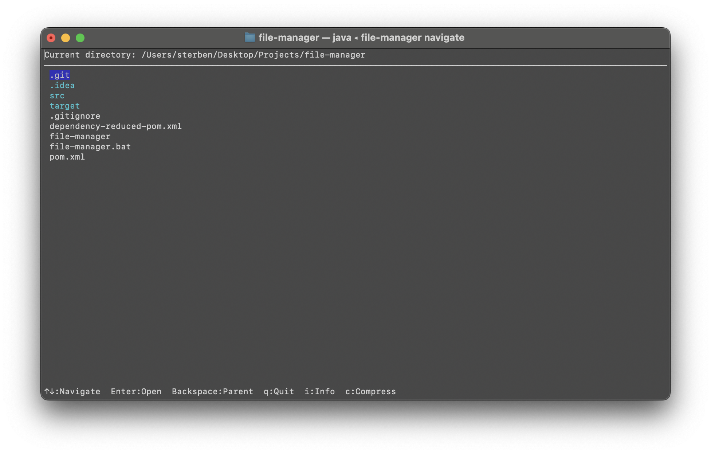

# Java File Manager

[](https://github.com/GiornoRetr0/file-manager/actions)
[](https://www.oracle.com/java/technologies/downloads/)

A terminal-based file management system with both GUI navigation and CLI commands.



## Features
- **Interactive Navigation**: Browse files and directories using arrow keys.
- **File Operations**:
    - Copy files and directories.
    - Move files and directories.
    - Delete files/directories.
    - Rename files/directories.
    - Compress files/directories into ZIP.
- **File Information**: View detailed metadata about files.
- **Cross-Platform**: Works on Windows, macOS, and Linux.
- **Dual Interface**: Both GUI (terminal-based) and CLI modes.

## Installation

### Prerequisites
- Java 17 or higher.
- Maven.
- MySQL (optional, for metadata storage).

### Build
```bash
mvn clean package
```

## Usage

### Terminal Navigation Mode
```bash
./file-manager navigate
```

### CLI Commands
- Copy files/directories:
  ```bash
  ./file-manager copy <source> <destination>
  ```
- Move files/directories:
  ```bash
  ./file-manager move <source> <destination>
  ```
- Delete files/directories:
  ```bash
  ./file-manager delete <path>
  ```
- Compress files/directories:
  ```bash
  ./file-manager compress <source>
  ```

### Navigation Keys
| Key       | Action                           |
|-----------|----------------------------------|
| ↑ ↓       | Navigate files                   |
| Enter     | Open directory/file              |
| Backspace | Go to parent directory           |
| I         | Show file information            |
| C         | Compress selected file/directory |
| Q         | Quit                             |

## Development

### Running Tests
```bash
mvn test
```

### Adding New Commands
1. Create a new command class implementing the `Command` interface.
2. Add command handling in `FileManagerCLI`.
3. Update help documentation.

## Troubleshooting

### Common Issues
1. **Permission Denied**:
   ```bash
   chmod +x file-manager
   ```
2. **Java Version Error**:
   Ensure Java 20+ is installed:
   ```bash
   java -version
   ```
